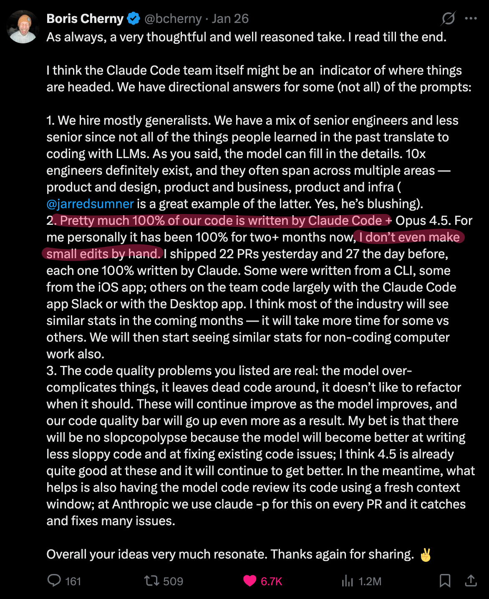

# Coding Agents on Databricks Apps

### What is it?

TL;DR: Run Claude Code, Gemini CLI, and OpenCode on Databricks Apps - all from the browser.

A browser-based terminal emulator that gives every Databricks user access to AI coding agents, wired up to model serving endpoints on their workspace. No IDE setup, no local installs.

### Why now?
On Jan 26. 2026, Andrej Karpathy made [this viral tweet](https://x.com/karpathy/status/2015883857489522876?s=46&t=tEsLJXJnGFIkaWs-Bhs1yA). Boris Cherny, the creator of claude code responded and said the following.


This app template opens this up for all Databricks Users!

No more pesky IDE setups, no bespoke tweaks.

Just use it all on Databricks, from the browser. Wired up to model serving endpoints on your workspace.

## Features

### 🤖 Coding Agents

| Agent | Model | Description |
|-------|-------|-------------|
| 🟠 **Claude Code** | `databricks-claude-sonnet-4-6` | Anthropic's coding agent with 39 skills + 2 MCP servers (Claude Code) |
| 🔵 **Gemini CLI** | `databricks-gemini-3-1-pro` | Google's coding agent with shared skills |
| 🟢 **OpenCode** | Auto-discovered | Open-source coding agent with native Databricks provider (auto-discovers models) |

Every agent starts **preconfigured to your Databricks AI Gateway endpoint** — models, auth tokens, and base URLs are all wired up at boot. No API keys to manage, no manual config.

### ⚡ Platform

> 🎮 **Zero-config terminal in your browser.** Open the app, play snake while it sets up, start coding.

| | |
|---|---|
| 🖥️ **Browser Terminal** | Full PTY with xterm.js — resize, scroll, 256-color, the works |
| 🐍 **Loading Screen** | Snake game while 6 setup steps run in parallel |
| 🔄 **Workspace Sync** | Every `git commit` auto-syncs to `/Workspace/Users/{you}/projects/` |
| 👤 **Auto Git Identity** | `user.name` + `user.email` from your Databricks token |
| 🔒 **Single-User Security** | Only the PAT owner gets in. Everyone else sees 403. |
| 🌐 **AI Gateway** | Route all models through Databricks AI Gateway |
| ✏️ **Micro Editor** | [micro](https://micro-editor.github.io/) — a modern terminal editor |
| ⚙️ **Databricks CLI** | Pre-configured with your PAT, ready to go |
| 🚀 **Gunicorn** | Production-grade server with gthread workers |
| 🔄 **Skill Refresh** | `/refresh-databricks-skills` pulls latest from [ai-dev-kit](https://github.com/databricks-solutions/ai-dev-kit) |

---

### 🧠 39 Skills

**🔶 25 Databricks Skills** — [ai-dev-kit](https://github.com/databricks-solutions/ai-dev-kit)

| | |
|---|---|
| 🤖 AI & Agents | agent-bricks, genie, mlflow-eval, model-serving |
| 📊 Analytics | aibi-dashboards, unity-catalog, metric-views |
| 🔧 Data Eng | declarative-pipelines, jobs, structured-streaming, synthetic-data, zerobus-ingest |
| 💻 Dev | asset-bundles, app-apx, app-python, python-sdk, config, spark-python-data-source |
| 🗄️ Storage | lakebase-autoscale, lakebase-provisioned, vector-search |
| 📚 Reference | docs, dbsql, pdf-generation |
| 🔄 Meta | refresh-databricks-skills |

**⚡ 14 Superpowers Skills** — [obra/superpowers](https://github.com/obra/superpowers)

| | |
|---|---|
| 🏗️ Build | brainstorming, writing-plans, executing-plans |
| 💻 Code | test-driven-dev, subagent-driven-dev |
| 🐛 Debug | systematic-debugging, verification |
| 👀 Review | requesting-review, receiving-review |
| 📦 Ship | finishing-branch, git-worktrees |
| 🔀 Meta | dispatching-agents, writing-skills, using-superpowers |

---

### 🔌 2 MCP Servers

| Server | What it does |
|--------|-------------|
| 📖 **DeepWiki** | Ask questions about any GitHub repo — gets AI-powered answers from the codebase |
| 🔍 **Exa** | Web search and code context retrieval for up-to-date information |

## Quick Start

### Prerequisites

- A Databricks workspace with Model Serving endpoints enabled
- A Personal Access Token (PAT)
- Databricks CLI installed locally (for deployment)

### Deploy to Databricks Apps

1. Clone this repo:
   ```bash
   git clone <repo-url>
   cd coding-agents-on-databricks
   ```

2. Copy and configure `app.yaml`:
   ```bash
   cp app.yaml.template app.yaml
   ```
   Edit `app.yaml` — set your `DATABRICKS_GATEWAY_HOST` or remove the gateway lines to fall back to direct model serving endpoints.

3. Create the app and configure the `DATABRICKS_TOKEN` secret:
   ```bash
   databricks apps create <your-app-name>
   ```
   In the [App Resources tab](https://docs.databricks.com/aws/en/dev-tools/databricks-apps/resources), add your PAT as the `DATABRICKS_TOKEN` secret. If using AI Gateway, also add `DATABRICKS_TOKEN`.

4. Sync and deploy:
   ```bash
   databricks sync . /Workspace/Users/<your-email>/apps/<your-app-name> --watch=false
   databricks apps deploy <your-app-name> \
     --source-code-path /Workspace/Users/<your-email>/apps/<your-app-name>
   ```

> **Important:** Use `databricks sync` (not `workspace import-dir`) to upload files. It respects `.gitignore` and handles the `.git` directory correctly.

### Run Locally

```bash
uv run python app.py
```

Open http://localhost:8000. This starts Flask's dev server — production uses Gunicorn.

## Architecture

```
┌─────────────────────┐     HTTP      ┌─────────────────────┐
│   Browser Client    │◄────────────►│   Gunicorn + Flask   │
│   (xterm.js)        │   Polling     │   (PTY Manager)     │
└─────────────────────┘               └─────────────────────┘
         │                                     │
         │ on first load                       │ on startup
         ▼                                     ▼
┌─────────────────────┐               ┌─────────────────────┐
│   Loading Screen    │               │   Background Setup  │
│   (snake game)      │               │   (6 parallel steps)│
└─────────────────────┘               └─────────────────────┘
                                               │
                                               ▼
                                      ┌─────────────────────┐
                                      │   Shell Process     │
                                      │   (/bin/bash)       │
                                      └─────────────────────┘
```

### Startup Flow

1. Gunicorn starts, calls `initialize_app()` via `post_worker_init` hook
2. App immediately serves the loading screen (snake game)
3. Background thread runs setup steps: git config, micro editor, Claude CLI, OpenCode, Gemini CLI, Databricks CLI
4. `/api/setup-status` endpoint reports progress to the loading screen
5. Once complete, the loading screen transitions to the terminal UI

### API Endpoints

| Endpoint | Method | Description |
|----------|--------|-------------|
| `/` | GET | Loading screen (during setup) or terminal UI |
| `/health` | GET | Health check with session count and setup status |
| `/api/setup-status` | GET | Setup progress for loading screen |
| `/api/session` | POST | Create new terminal session |
| `/api/input` | POST | Send input to terminal |
| `/api/output` | POST | Poll for terminal output |
| `/api/resize` | POST | Resize terminal dimensions |
| `/api/session/close` | POST | Close terminal session |

## Configuration

### Environment Variables

| Variable | Required | Description |
|----------|----------|-------------|
| `DATABRICKS_TOKEN` | Yes | Your Personal Access Token (secret) |
| `HOME` | Yes | Set to `/app/python/source_code` in app.yaml |
| `ANTHROPIC_MODEL` | No | Claude model name (default: `databricks-claude-opus-4-6`) |
| `GEMINI_MODEL` | No | Gemini model name (default: `databricks-gemini-3-1-pro`) |
| `DATABRICKS_GATEWAY_HOST` | No | AI Gateway URL (recommended). Falls back to direct model serving if unset |
| `DATABRICKS_TOKEN` | No | AI Gateway token (secret, required if using gateway) |

### Security Model

This is a **single-user app**. Each user deploys their own instance with their own PAT:

1. The `DATABRICKS_TOKEN` in `app.yaml` identifies the owner
2. At startup, the app determines the token owner via Databricks API
3. Only requests from the token owner are allowed
4. Other users see a 403 Forbidden error

### Gunicorn Configuration

Production uses Gunicorn (`gunicorn.conf.py`) with:
- `workers=1` — PTY file descriptors and in-memory session state can't survive forking
- `threads=8` — Handles concurrent polling from the terminal client
- `worker_class=gthread` — Single process + thread pool
- `post_worker_init` hook calls `initialize_app()` to start setup

## Project Structure

```
coding-agents-on-databricks/
├── .claude/
│   └── skills/              # 39 pre-installed skills
├── app.py                   # Flask backend with PTY management + setup orchestration
├── app.yaml                 # Databricks Apps deployment config
├── app.yaml.template        # Template for app.yaml
├── gunicorn.conf.py         # Gunicorn production server config
├── CLAUDE.md                # Claude Code instructions
├── requirements.txt         # Python dependencies
├── setup_claude.py          # Claude Code CLI + MCP configuration
├── setup_gemini.py          # Gemini CLI configuration
├── setup_opencode.py        # OpenCode CLI configuration
├── setup_databricks.py      # Databricks CLI configuration
├── sync_to_workspace.py     # Post-commit hook: sync to Databricks Workspace
├── install_micro.sh         # Micro editor installer
├── static/
│   ├── index.html           # Terminal UI (xterm.js)
│   ├── loading.html         # Loading screen with snake game
│   └── lib/                 # xterm.js library files
└── docs/
    └── plans/               # Design documentation
```

## Workspace Sync

Git commits automatically sync projects to Databricks Workspace:

```
/Workspace/Users/{email}/projects/{project-name}/
```

The post-commit hook uses `nohup ... & disown` to ensure the sync process survives across all coding agents (Claude Code, Gemini CLI, OpenCode), since some agents kill the entire process group when a shell command finishes.

## Technologies

- **Backend**: Flask, Gunicorn (gthread), Python PTY/termios
- **Frontend**: xterm.js, FitAddon
- **Agents**: Claude Code CLI, Gemini CLI, OpenCode
- **Integration**: Databricks SDK, Databricks AI Gateway
